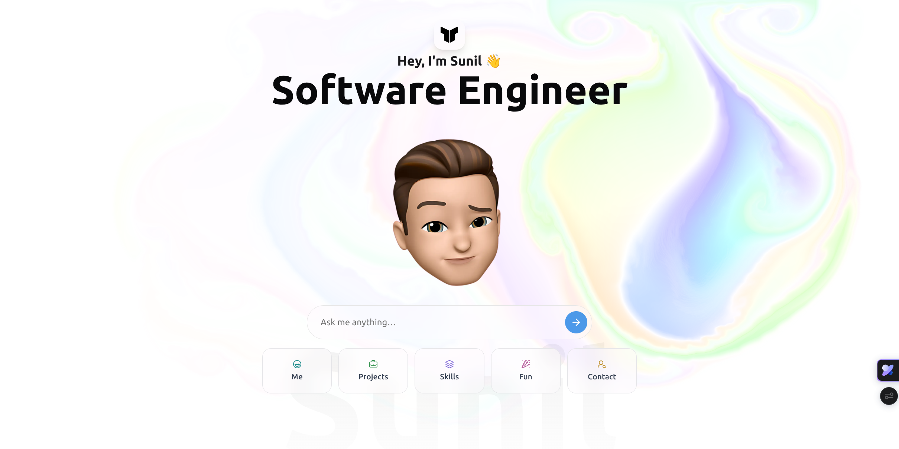

# Sunil Bhadu — AI Portfolio 🤖✨

**Static portfolios are dead.**
This is a conversational AI portfolio — instead of making you scroll, it _talks_ to you.

Ask a question, and an AI avatar powered by my background, experience, and live GitHub data replies instantly.

> Built with **Next.js 15**, **TypeScript**, **Tailwind CSS v4**, and **Anthropic Claude API**.

---

## 👇 What can you ask?

- 🧠 **Tech recruiter?** Ask about my stack, projects & achievements
- 💻 **Fellow dev?** Dive into my code, architecture decisions & mindset
- 🧑‍🤝‍🧑 **Just curious?** See what I've been building lately

---

## 🙋 About Me

**Sunil Bhadu** — Full Stack Developer from Surat, India.

- 🎓 B.Tech in IT from Dhole Patil College of Engineering, Pune (SPPU) — **8.4 CGPA**
- 💼 3+ years of experience building healthcare SaaS, payment systems & open source tools
- 🛠️ Core stack: **Node.js · NestJS · MongoDB · PostgreSQL · React · Next.js · TypeScript**
- 🌐 Projects: [Neem Health](https://neemhealth.ai) · [SubOS](https://subos.io) · [Impler](https://impler.io) · [Omniva Telehealth](https://omnivatelehealth.com) · [EaseCare](https://easecare.ca) · [WonderMD](https://wondermd.ca)
- 📫 [sunilbhadu155@gmail.com](mailto:sunilbhadu155@gmail.com) · [LinkedIn](https://www.linkedin.com/in/sunil-bhadu-xx) · [GitHub](https://github.com/SunilBhadu)

---

## 🚀 Key Features

- 💬 **AI Conversational Interface:** Context-aware chat assistant using Claude Sonnet 4.
- 🐙 **Live GitHub Integration:** The AI knows about my latest repositories and contributions.
- 📱 **Apple-Style Cards Carousel:** Interactive project showcase with fluid animations.
- ✨ **Fluid Cursor & Particles:** Premium UI experience with custom animations.
- 🌓 **Dark/Light Mode:** Seamless theme switching with persistent preferences.

---

## 🛠️ Tech Stack

| Layer           | Technology                                         |
| --------------- | -------------------------------------------------- |
| Framework       | Next.js 15.1 (App Router)                          |
| Language        | TypeScript                                         |
| Styling         | Tailwind CSS v4                                    |
| AI              | Anthropic Claude API (`@anthropic-ai/sdk`)         |
| Animations      | Framer Motion 12, Motion                           |
| UI Components   | Radix UI, Lucide Icons, Shadcn UI                  |
| Particles       | TSParticles                                        |
| Package Manager | pnpm                                               |

---

## 🚀 Running Locally

### Prerequisites

- **Node.js** v20 or higher
- **pnpm** package manager
- **Anthropic API token** (for AI chat functionality)
- **GitHub Token** — for GitHub integration

### Setup

1. **Clone the repository**

   ```bash
   git clone https://github.com/SunilBhadu/portfolio.git
   cd portfolio
   ```

2. **Install dependencies**

   ```bash
   pnpm install
   ```

3. **Set up environment variables**
   Create a `.env.local` file in the root directory:

   ```env
   ANTHROPIC_API_KEY=your_anthropic_api_key_here
   GITHUB_TOKEN=your_github_token_here
   ```

4. **Start the development server**

   ```bash
   pnpm dev
   ```

5. **Open in browser**
   Navigate to [http://localhost:3000](http://localhost:3000)

### Getting API Keys

- **Anthropic API Key** → [console.anthropic.com](https://console.anthropic.com/)
- **GitHub Token** → [github.com/settings/tokens](https://github.com/settings/personal-access-tokens) _(repo scope)_

---

#### 🔖 Tags

`#AIPortfolio` `#FullStackDeveloper` `#DigitalResume` `#NextJS` `#TypeScript` `#Anthropic` `#Claude` `#WebDevelopment` `#SunilBhadu` `#TailwindCSS4`
